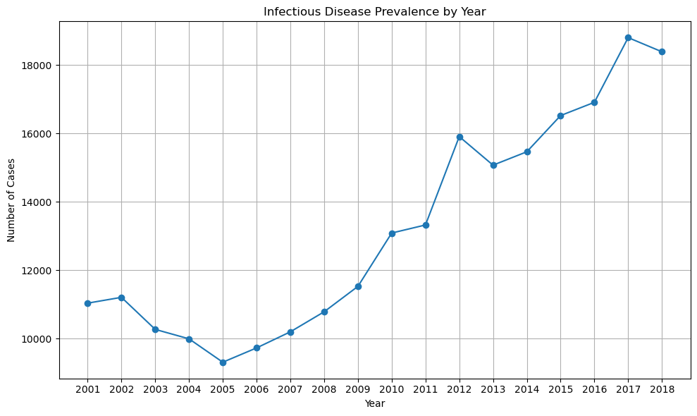
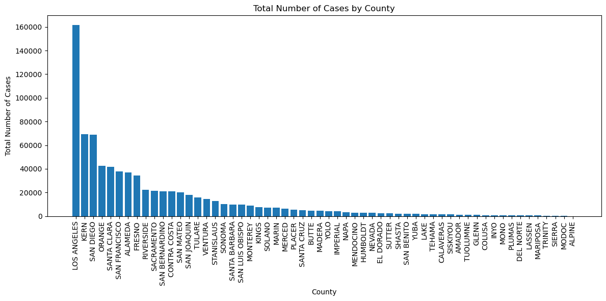
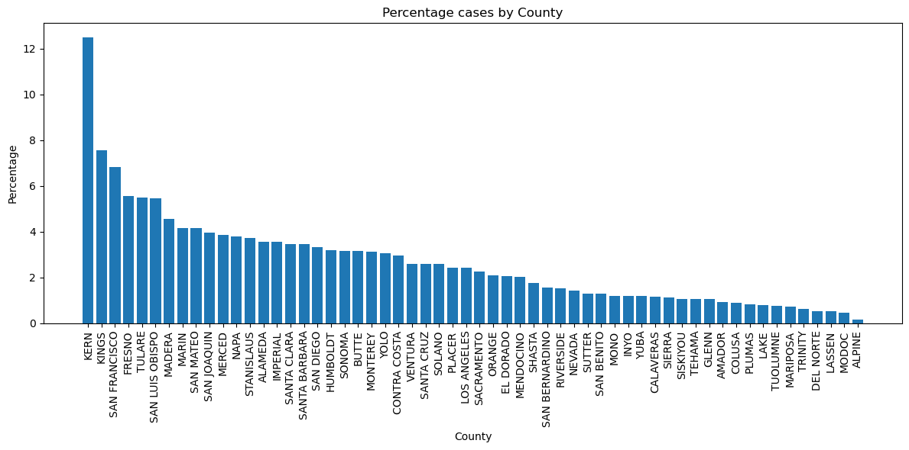
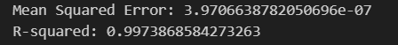

The Project

This Project uses data from California Health and Human Services to determine statistical trends and patterns in communicable diseases within California. The project involved identifying the relationship between population and the different infectious diseases.

The Process

It involved loading the dataset, Cleaning and transforming the data in Python, Performing EDA, statistical analysis and visualizations, Identifying trends and patterns in data using statistical models and interpreting the results of the statistical models. 

About the dataset

The dataset contains case counts and rates for selected communicable diseases—listed in the data dictionary—that met the surveillance case definition for that disease and was reported for California residents, by disease, county, year, and sex. The data represent cases with an estimated illness onset date from 2001 through the last year indicated from California Confidential Morbidity Reports and/or Laboratory Reports. 

Data Source: https://www.cdph.ca.gov/Programs/CID/DCDC/Pages/IDB.aspx.

The Results

It was observed that there was a general steady climb in the number of infectious diseases in the state of California over the study period.

 Los Angeles had the highest number of infectious diseases with Campylobacteriosis leading as the most prevalent. 
 
 
 

 
 
 
 Whereas the County of Kern had the highest percentage of infections as compared to their population. 

Modelling was done on the dataset to predict infectious diseases based on the population. i.e if a county would have positive cases or not. The random Forest classifier gave the best results amoung all the classifiers with accuracy of 0.97 and Recall of 0.88.

Further analysis was done to predict the number of cases a county would likely have. The Random Forest Regressor gave the best metrics at predicting the cases based on population and rate of infections.

The MSE measures the average squared difference between the predicted values and the actual values. A lower MSE value indicates better performance model, which means the model is making and or would make accurate predictions.The R-squared value represents the proportion of the variance in the dependent variable (number of cases) that is predictable from the independent variable(s) (population and rate). An R-squared value closer to 1 indicates a better fit, this suggests that it explains a larger proportion of the variance in the number of cases.
